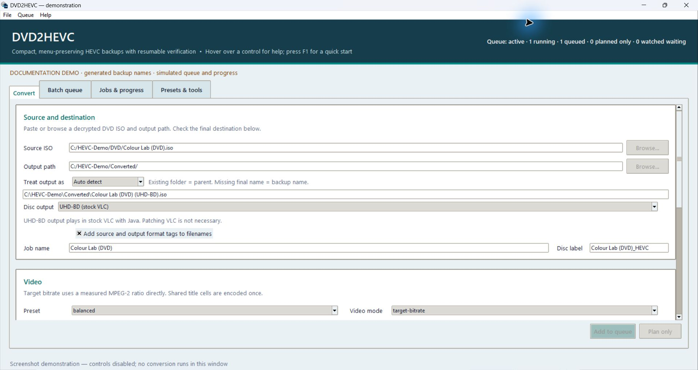
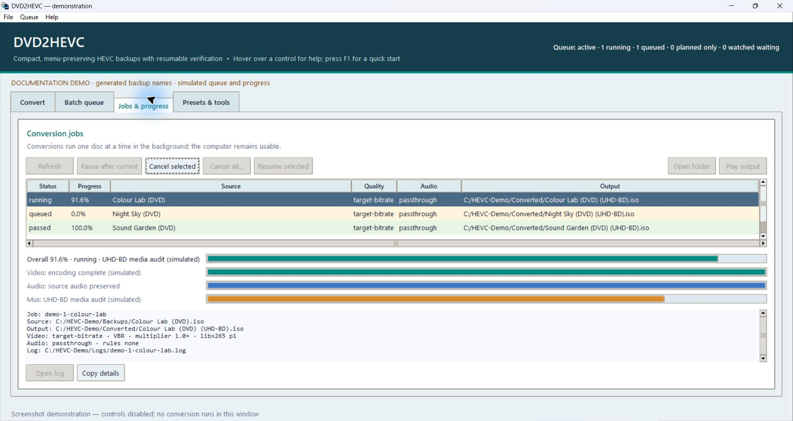

# DVD2HEVC

**Smaller DVD backups with the original disc experience.** DVD2HEVC converts
already-decrypted DVD ISOs from MPEG-2 to HEVC, preserving the original menus,
extras, chapters, shared footage and audio/subtitle choices.

**0.2.0a1 alpha: UHD-BD output is now the default.** The DVD virtual machine runs
in BD-J inside a BDMV/UDF 2.50 image. **Stock VLC with Java can play it; patching
VLC is not necessary.** The explicit legacy HEVC DVD option remains available
for its private patched player.

Video retains its DVD resolution and cadence policy. “UHD-BD” identifies the
HEVC Blu-ray structure used for VLC playback; it does not promise 4K upscaling,
HDR creation or hardware UHD player conformance. This remains experimental:
keep original backups and check the routes you use before relying on a result.

Source and alpha downloads: [DVD2HEVC on GitHub](https://github.com/nathanturk2/DVD2HEVC).



*The real GUI with generated backup names. Documentation queue/progress examples
are labelled simulated; conversion evidence is recorded separately.*

## Install and check tools

The complete conversion workflow targets Windows 10/11 and accepts local,
already-decrypted DVD ISO backups. DVD2HEVC does not decrypt discs.

| Requirement | Purpose |
| --- | --- |
| Python 3.10+ with Tkinter | CLI and desktop GUI |
| FFmpeg / FFprobe and HandBrakeCLI | Encoding, source inspection and validation |
| A working HEVC encoder | NVENC, QSV, AMF or software x265; available hardware is probed |
| Native DVD inspector | Built from pinned libdvdread source; needs Git, Visual Studio C++ tools, Meson and Ninja |
| tsMuxeR with `--blu-ray-v3` | UHD-BD transport/playlist authoring |
| Stock VLC with libbluray BD-J and a Java 11 JDK | Compile DVD navigation and play/validate it |
| Hadris streaming UDF author | Included for Windows x64, with fork source and MIT notice |
| Temporary storage | Encoding stage, BDMV media and verified ISO coexist during authoring |

Extract the source release into a permanent directory:

```powershell
python -m pip install .
python -m pip install meson ninja
python dvd2hevc.py build-inspector
$env:JAVA_HOME = 'C:\Program Files\Eclipse Adoptium\YOUR_JAVA_11_JDK'
python dvd2hevc.py tools
python dvd2hevc.py gui
```

Install external tools separately. Put FFmpeg, FFprobe, HandBrakeCLI and
tsMuxeR on `PATH`; `DVD2HEVC_TSMUXER` can identify a tsMuxeR executable.
`DVD2HEVC_STOCK_VLC_ROOT` can identify a stock VLC directory. Authoring also
accepts `--tsmuxer`, `--udf-tool`, `--java-home` and `--vlc-root` overrides.
The BD-J API JAR comes from VLC's `plugins/access`; it is not bundled here.
No private VLC build is required for the default output.

For a desktop shortcut:

```powershell
powershell -NoProfile -ExecutionPolicy Bypass -File tools\install-gui-shortcut.ps1
```

Wheels include the GUI assets, documentation, runners, Java source and Windows
UDF author. Jobs/reports live under `%LOCALAPPDATA%\DVD2HEVC`, or
`DVD2HEVC_STATE_DIR`; larger workspaces are separately recorded in each job.
See [tool provenance](docs/TOOL_PROVENANCE.md) and
[third-party notices](THIRD_PARTY_NOTICES.md).

A wheel installation also provides `dvd2hevc-gui`, which launches the desktop
interface without a console window on Windows.

## Convert

1. Choose the source ISO and destination in **Convert**.
2. Leave **Disc output** at **UHD-BD (stock VLC)**. The GUI explains that VLC
   patching is unnecessary. Generated filenames use `(DVD) (UHD-BD)` tags.
3. Choose quality, encoder, deinterlacing and audio policy. The balanced default
   uses VBR at 25% of measured source MPEG-2 video bitrate; passthrough audio is
   the default. CQ values trade quality against size.
4. Use **Plan only**, then **Add to queue**. Unsupported angle/random structures
   in the current BD-J implementation fail during UHD-BD planning.
5. Watch **Jobs & progress**. The overall and mux bars include BDMV authoring,
   the full media audit, measured ISO writing, payload verification and the
   stock-VLC startup gate. They reach 100% only when the job passes.
6. Use **Play output**. It opens UHD-BD through VLC's Blu-ray/menu mode with
   Java, or chooses the private player for a legacy HEVC DVD.



```powershell
dvd2hevc auto 'D:\Backups\Movie.iso' --dry-run
dvd2hevc start 'D:\Backups\Movie.iso'
dvd2hevc status --watch
dvd2hevc queue 'D:\Backups' --output-dir 'F:\Converted'
dvd2hevc watch-folder 'D:\Incoming' --output-dir 'F:\Converted' --recursive
```

Batch queues and watched folders retain their chosen output format and settings.
Previously queued legacy jobs/watches keep their original format. Presets save
the new choice. Pause-after-current, cancellation and safe resume remain
available. Sources are opened read-only, and existing outputs are protected.
The new final ISO is published after payload and player checks pass; failed
authoring attempts retain diagnostics. A failed partial BD-J build currently
restarts that authoring attempt, while completed encoding work can be reused.

## Existing HEVC DVD backups and legacy output

Upgrade an existing DVD2HEVC backup without reencoding its HEVC pictures:

```powershell
dvd2hevc author-uhd 'D:\Backups\Movie (DVD) (HEVC).iso' 'F:\Converted\Movie (DVD) (UHD-BD).iso' --work-dir 'F:\Work\Movie'
```

For the older custom DVD format, select **HEVC DVD (legacy player)** or use
`--output-format dvd-hevc`. That option requires the private player described
in [VLC_BUILD.md](docs/VLC_BUILD.md), plus genisoimage/mkisofs. UHD-BD output
uses stock VLC and the included UDF writer instead.

## What has been tested

The UHD-BD author/navigation work has a **13-disc commercial DVD backup corpus**:
Home Alone, Taken 2, The Bourne Identity, Mission: Impossible, Moonlighting
disc 1, The Curious Case of Benjamin Button feature and bonus discs, Gladiator,
Taken 3, The Intern, I, Robot feature and bonus discs, and The Bourne Supremacy.
It covers **1,871 physical clips, 249 titles and 1,044 PGCs**.
Taken 3's two cuts share 53 physical clips. The full retained media audits cover
4,453,387 original HEVC picture NALs and 1,696 audio tracks, with the precise
full-payload versus complete-access-unit scopes recorded in
[the UHD-BD notes](docs/UHD_BD.md).

The Java VM comparison passes 24,584 real/generated cases with zero unexplained
mismatches; 92 upstream signed-multiplication overflow differences are explicit.
Nine current final images pass UDF/payload checks and selected original-startup
stock-VLC tests. Selected menus, extras, subtitle/audio changes, chapters,
seeks, pause/resume, stills, galleries and both Taken 3 editions were exercised.
The corpus does not represent full films watched end-to-end or every path tested.

The older conversion catalogue contains **117 legacy HEVC DVD images** in its
30 September 2026 snapshot. [TESTED_DISCS.md](docs/TESTED_DISCS.md) lists those
examples; catalogue presence is not fresh certification of the UHD-BD path.
The generated **Colour Lab** DVD also passes the integrated MPEG-2 → HEVC →
BD-J/UDF workflow using software x265 and stock VLC. Run
`python tools/make-demo.py NEW_DIRECTORY --convert` to reproduce it with the
external tools installed. Its pictures and audio are generated by FFmpeg.

Current gaps include eight ambiguous/nonseamless AC-3 boundaries on the bonus
disc, broader whole-title A/V continuity and timed visual comparisons,
multi-angle and random/shuffle playback, and complete native VLC UOP handling.
Taken 3's extended movie run exposes 32 native chapters versus 33 DVD chapters;
its independent final chapter and original post-play menu route work.
Original caption artwork is rendered in BD-J; native clear-only PGS channels
provide selection, not standalone exported caption artwork.

## Support and development

Read the retained job error/log first. To prepare a support bundle:

```powershell
dvd2hevc diagnose JOB_ID --output 'F:\Support\diagnostics.zip'
```

Known private paths are redacted and media is omitted; review the bundle before
sharing. Include versions, encoder/settings and the exact failed menu route.
Do not upload copyrighted disc media or keys.

- [UHD-BD implementation, evidence and limits](docs/UHD_BD.md)
- [Supported scope](docs/SUPPORTED.md), [capabilities](docs/CAPABILITIES.md)
- [Publishing](docs/PUBLISHING.md), [release checklist](docs/RELEASE_CHECKLIST.md)
- [Legacy workflow reference](docs/WORKFLOW_REFERENCE.md)
- [Contributing](CONTRIBUTING.md), [changelog](CHANGELOG.md)

The combined source is GPL-3.0-only. The DVD VM retains libdvdnav attribution;
the imported BD2HEVC UDF reader/validator and bundled Hadris source have their
notices. External VLC, Java, FFmpeg and tsMuxeR binaries and film/menu/subtitle
assets are not included in the source release.

Release details and local validation: [RELEASE_NOTES.md](docs/RELEASE_NOTES.md).
